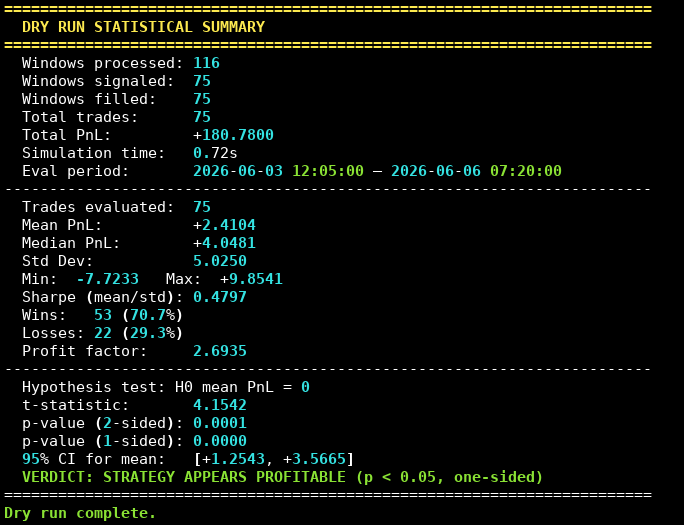

# Polyfon

**Quantitative Trading System for 5-Minute Crypto Prediction Markets on Polymarket**

Polyfon is a Python-based trading infrastructure designed to discover, collect, and trade 5-minute crypto-resolution binary prediction markets on Polymarket. It supports multiple trading strategies, real-time data collection via WebSocket, and three execution modes (collect, dry, shadow).

---



---
## Features

- **Real-time data collection** via WebSocket — Binance spot feeds + Polymarket order book
- **SQLite database** — single-file, portable, no external daemon
- **SQLAlchemy 2.0 async ORM** — type-safe async database operations
- **Pluggable strategy framework** — `@register` decorator + `BaseStrategy` interface
- **18+ strategy slots** — 12 implemented (SLA, WDM, TDE, ROM, PMR, OBI, MPR, VIT, CRV, CLL, VPX, HMM); 6 more planned
- **Replay plans** — each strategy defines its own dry-mode evaluation cadence
- **Accurate fee modeling** — Polymarket taker fees per official documentation
- **Realized PnL reporting** — dry mode fetches resolved Windows and computes net PnL
- **Window-slug filtering** — run strategies on specific windows by slug

---

## Quick Start

### Prerequisites

- Python 3.11+
- Internet access (WebSocket feeds, REST APIs)

### Installation

```bash
git clone <repo-url> && cd polyfon
python3 -m venv .venv && source .venv/bin/activate
pip install -e .
```

After installation you can run Polyfon either as:

```bash
python3 -m scripts.run <command>
```

or via the installed console script:

```bash
polyfon <command>
```

### Configuration

```bash
cp .env.example .env
```

Edit `.env`:

```env
DATABASE_URL=sqlite+aiosqlite:///./polyfon.db
POLYMARKET_API_URL=https://clob.polymarket.com
BINANCE_WS_URL=wss://stream.binance.com:9443/ws
COINS=BTC,ETH
LOG_LEVEL=INFO
LOG_VERBOSITY=minimal
```

`LOG_VERBOSITY` controls how noisy runtime logs are:

- `minimal` — suppress chatty dependency logs like `httpx` request lines; recommended default
- `normal` — keep Polyfon collector info logs while still suppressing low-level HTTP chatter
- `debug` — leave all configured loggers at the configured `LOG_LEVEL`

### `.env` Reference

| Key | Type | Default | Description |
|-----|------|---------|-------------|
| `DATABASE_URL` | str | `sqlite+aiosqlite:///./polyfon.db` | SQLite database connection string |
| `POLYMARKET_API_URL` | str | `https://clob.polymarket.com` | Polymarket CLOB REST API base URL |
| `BINANCE_WS_URL` | str | `wss://stream.binance.com:9443/ws` | Binance WebSocket stream base URL |
| `COINS` | str | `BTC,ETH` | Comma-separated coin symbols to track |
| `LOG_LEVEL` | str | `INFO` | Root logger level (`DEBUG`, `INFO`, `WARNING`, `ERROR`) |
| `LOG_VERBOSITY` | str | `minimal` | Controls dependency log noise: `minimal`, `normal`, `debug` |
| `SOCKS5_PROXY_URL` | str | — | Global SOCKS5 proxy fallback for all outbound traffic |
| `POLYMARKET_WS_PROXY_URL` | str | — | SOCKS5 proxy override for Polymarket WebSocket only |
| `POLYMARKET_HTTP_PROXY_URL` | str | — | SOCKS5 proxy override for Polymarket HTTP only |
| `BINANCE_WS_PROXY_URL` | str | — | SOCKS5 proxy override for Binance WebSocket only |
| `BINANCE_SILENCE_THRESHOLD_SEC` | float | `5.0` | Seconds without Binance tick before window is invalidated |
| `DISCOVERY_HORIZON_MINUTES` | int | `720` | How far ahead to discover/scan upcoming windows |
| `CLOCK_SOURCE` | str | `system` | Clock sync source: `system` or `binance` |
| `CLOCK_SYNC_INTERVAL_SEC` | int | `60` | How often to resync clock when `CLOCK_SOURCE=binance` |

### Optional: SOCKS5 proxy support

If Polymarket is blocked from your server region, you can route outbound traffic through a SOCKS5 proxy.

Global proxy for all supported outbound paths:

```env
SOCKS5_PROXY_URL=socks5://127.0.0.1:1080
```

Or configure per service:

```env
POLYMARKET_WS_PROXY_URL=socks5://127.0.0.1:1080
POLYMARKET_HTTP_PROXY_URL=socks5://127.0.0.1:1080
BINANCE_WS_PROXY_URL=socks5://127.0.0.1:1080
```

Notes:

- `SOCKS5_PROXY_URL` is the fallback for all services.
- `POLYMARKET_WS_PROXY_URL` is used for the Polymarket market websocket.
- `POLYMARKET_HTTP_PROXY_URL` is used for Gamma/Polymarket HTTP discovery and resolution.
- `BINANCE_WS_PROXY_URL` is used for Binance spot websocket traffic.
- Proxy URLs should typically look like `socks5://host:port` or `socks5h://host:port`.
- If only Polymarket is blocked from your region, prefer setting only `POLYMARKET_WS_PROXY_URL` and `POLYMARKET_HTTP_PROXY_URL` so Binance stays direct.
- SOCKS websocket support requires the `python-socks` package. It is included in project dependencies; if you installed before this change, run `pip install -e .` again.

---

## CLI Reference

All commands are run via either:

```bash
python3 -m scripts.run <command> [options]
polyfon <command> [options]
```

### `collect` — Data Collection Only

```bash
python3 -m scripts.run collect                    # default coins from .env
python3 -m scripts.run collect --coins=BTC,ETH

# equivalent
polyfon collect
polyfon collect --coins=BTC,ETH
```

- Discovers active 5-minute crypto markets via Polymarket REST API
- Opens/closes 5-minute trading windows aligned to ET clock boundaries
- Streams Binance spot prices (1-second ticks) into `spot_prices`
- Streams Polymarket order book best bid/ask into `order_books`
- Resolves closed windows via Gamma API polling every 60s

### `dry` — Historical Simulation

Runs a strategy on historical windows already in the database. Computes signals and realized PnL using resolved outcomes.

```bash
python3 -m scripts.run dry --strategy=WDM
python3 -m scripts.run dry --strategy=TDE --coins=BTC
python3 -m scripts.run dry --strategy=ROM --param tau_max=90 --param tau_min=45
python3 -m scripts.run dry --strategy=SLA --window-slugs=BTC_20260524_0510,BTC_20260524_0515
```

Options:

| Flag | Description |
|------|-------------|
| `--strategy` | Strategy name (`SLA`, `WDM`, `TDE`, `ROM`, `PMR`, `OBI`, `MPR`, `VIT`, `CRV`, `CLL`, `VPX`, `HMM`) |
| `--coins` | Comma-separated coin filter |
| `--collect` | Also run live data collection in parallel |
| `--window-slugs` | Comma-separated window slugs to restrict execution |
| `--param` | Strategy parameter as `key=value` (repeatable) |
| `--replay-cadence-seconds` | Override strategy's replay cadence |

Output: per-window status (`SIGNAL` / `SKIP`), trade signals logged to DB, realized PnL summary.

### `shadow` — Real-Time Simulation

Like wet mode but no real orders. Tracks simulated PnL in real time.

```bash
python3 -m scripts.run shadow --strategy=WDM --collect
python3 -m scripts.run shadow --strategy=TDE --coins=BTC,ETH
```

### `list-strategies`

```bash
python3 -m scripts.run list-strategies
polyfon list-strategies
```

---

## Collection Troubleshooting

### Order books are not being collected

If `spot_prices` are arriving but `order_books` stay empty or barely grow, check the following:

1. **Use the current invocation style**

   Prefer:

   ```bash
   python3 -m scripts.run collect
   ```

   or:

   ```bash
   polyfon collect
   ```

2. **Watch for discovery/open logs**

   The order-book collector only subscribes after market discovery yields token IDs for pending/open windows. On startup you should see log lines like:

   - `DISCOVERED ...`
   - `OPEN ...`

   If you see only status lines like `waiting for next window` and never see `DISCOVERED`, then the issue is upstream in market discovery, not the websocket book collector.

3. **Understand what gets subscribed**

   Polyfon does **not** subscribe to a generic global Polymarket book feed. It subscribes only to token IDs belonging to windows discovered by Gamma. No discovered windows = no order-book subscription = no `order_books` rows.

4. **Check the DB directly**

   ```bash
   sqlite3 polyfon.db "select count(*) from windows;"
   sqlite3 polyfon.db "select status, count(*) from windows group by status;"
   sqlite3 polyfon.db "select count(*) from order_books;"
   ```

   If `windows` is empty or only contains stale/old rows, order-book collection will not start correctly for the current session.

5. **Expected startup behavior**

   On a healthy startup, collection should do all of the following:

   - initialize the DB
   - discover upcoming 5-minute windows
   - start Binance spot collection immediately
   - start Polymarket book collection once token IDs are available
   - open the active window exactly on the ET 5-minute boundary

6. **Current implementation detail**

   Order-book collection is boundary- and discovery-driven. If you start in the middle of a slot, Polyfon may wait until the next window boundary before you see the first meaningful stream of book updates for the newly opened window.

### Recommended first-run check

After install:

```bash
cp .env.example .env
python3 -m scripts.run collect --coins=BTC
```

Then in another shell:

```bash
sqlite3 polyfon.db "select count(*) from spot_prices;"
sqlite3 polyfon.db "select count(*) from order_books;"
sqlite3 polyfon.db "select status, count(*) from windows group by status;"
```

If `spot_prices` grows but `order_books` does not, capture the collector console output — especially whether `DISCOVERED` and `OPEN` lines appear.

---

## Implemented Strategies

| Name | Description |
|------|-------------|
| **SLA** | Spot-Led Latency Arbitrage — exploits lag between CEX spot moves and Polymarket pricing |
| **WDM** | Window Delta Momentum — entry at T-10s based on spot displacement from open |
| **TDE** | Time Decay Effect — entry when fair-probability theta agrees mispricing is widening |
| **ROM** | Range Oscillation Momentum — entry when spot is in top/bottom 20% of intra-window range |
| **PMR** | Price Momentum Reversal — entry on momentum exhaustion with volatility filter |
| **OBI** | Order Book Imbalance — entry when order-book imbalance signals directional pressure |
| **MPR** | Mean Price Reversion — entry when spot deviates from intra-window mean |
| **VIT** | Volume-Spike Informed Trading — entry on spot volume spikes above threshold |
| **CRV** | Cross-Contract Relative Value — entry when correlated contracts diverge |
| **CLL** | Cross-Asset Correlation Lead-Lag — entry when leader moves but lagger hasn't repriced |
| **VPX** | CEX Toxicity Volatility Indicator — entry on volatility regime shifts detected by VPX ratio |
| **HMM** | Hidden Markov Model Regime-Switching — regime-aware entry inferred from market features |

Each strategy has its own `ReplayPlan` that defines when `on_tick` is evaluated during dry mode:

| Strategy | Dry-mode evaluation |
|----------|-------------------|
| SLA | Scans from window open until `tau_min` |
| WDM | Evaluates at T-10s |
| TDE | Scans τ ∈ [15, 90]s |
| ROM | Scans τ ∈ [30, 120]s |
| PMR | Scans τ ∈ [30, `tau_max`]s |
| OBI | Scans τ ∈ [30, `tau_max`]s |
| MPR | Scans τ ∈ [30, `tau_max`]s |
| VIT | Scans τ ∈ [30, `tau_max`]s |
| CRV | Evaluates at T-30s |
| CLL | Scans τ ∈ [τ_min, 120]s |
| VPX | Scans τ ∈ [60, 240]s |
| HMM | Scans τ ∈ [60, 240]s |

Add a new strategy by creating `polyfon/strategies/<name>.py`, inheriting `BaseStrategy`, decorating with `@register`, and importing in `polyfon/strategies/__init__.py`.

---

## Architecture

```
scripts/run.py (click CLI)
    collect   → CollectionOrchestrator
    dry       → ExecutionEngine(mode="dry")
    shadow    → ExecutionEngine(mode="shadow")

CollectionOrchestrator:
    PolymarketDiscovery  →  REST: discover 5-min crypto markets
    BinanceSpotCollector  →  WS: spot prices → DB
    PolymarketBookCollector  →  WS: best bid/ask → DB
    WindowManager  →  timer-driven open/close at 5-min ET boundaries
    _resolve_orphans  →  Gamma API resolution polling (60s)

ExecutionEngine:
    loads strategy via StrategyRegistry
    builds Context (spot, book, fair prob, tau, range_high/low)
    calls strategy.on_tick(window, context) → Signal
    simulates long-only Polymarket entries (`BUY_YES` / `BUY_NO` only), computes PnL at window resolution
```

Polymarket simulation note: this project does not model synthetic short instruments. Bearish exposure is expressed as `BUY_NO`, not `SELL_YES`.

### Database Schema

| Table | Purpose |
|-------|---------|
| **collect_run_sessions** | Tracks collector start/stop |
| **windows** | 5-minute trading windows (slug, underlying, start_et, end_et, status, outcome) |
| **spot_prices** | Binance spot ticks (symbol, price, timestamp) |
| **order_books** | Best bid/ask per token (token_id, best_bid, best_ask, stale flag) |
| **trade_signals** | Strategy entry signals (direction, size, edge, confidence) |
| **positions** | Simulated/real bought-contract records (YES / NO contract, entry_price, size, pnl, fees, status) |
| **config_kv** | Key-value settings storage |

---

## Fee Calculation

Taker fee follows Polymarket documentation:

```
fee = round(shares * feeRate * price * (1 - price), 5)
```

- Crypto market `feeRate`: **0.07** (7%)
- Maker fee: **0**

Implemented in `polyfon/utils/fees.py`: `taker_fee_usdc()`, `net_pnl()`.

---

## Project Roadmap

| Phase | Status | Description |
|-------|--------|-------------|
| Phase 1 | ✅ Complete | Bootstrap: schema, config, WebSocket collectors, fair pricing, SLA, dry mode, CLI |
| Phase 2 | ✅ Complete | Shadow mode refinement, session tracking, resolution engine, orphan cleanup |
| Phase 3 | ⏸️ Postponed | Wet mode: real CLOB API orders |
| Phase 4 | 🔄 In Progress | Additional strategies: 12/18 implemented (SLA, WDM, TDE, ROM, PMR, OBI, MPR, VIT, CRV, CLL, VPX, HMM); 6 remaining (MIP, PFR, RND, HPE, KLD, ARL, EVT) |
| Phase 5 | 📝 Planned | ML bridge: GARCH volatility, EVT, HMM, Hawkes processes |

---

## Disclaimer

This software is for **research and simulation purposes only**. Trading financial instruments carries substantial risk of loss. No guarantee of profitability is expressed or implied.
